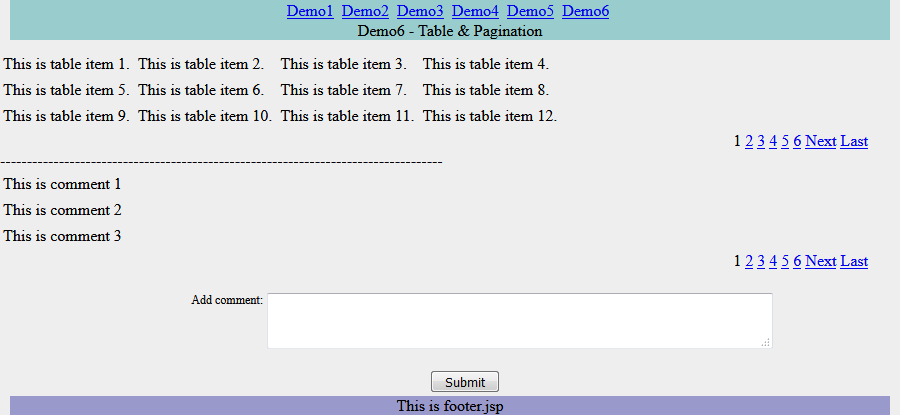

(English version see [README-English. md] (README-English. md))  
### jWebBox
** License:** [Apache 2.0](http://www.apache.org/licenses/LICENSE-2.0)  
 
This is a server (support JSP and FreeMaker) page layout tool, is characterized by simple, no XML, only 1000 lines of source code and Apache Tiles to achieve a similar page layout features.

### Some of the current disadvantages of the server-side JSP page layout tool：
* Apache Tiles: powerful but too bloated, complex source code, third-party library references and more, XML configuration inconvenient, poor dynamic configuration features.
* Sitemesh: using decorator mode, the function is not as flexible as Apache Tiles.  
* JSP layout tools like JSP Layout or Stripes: functionality is not strong enough, there is a problem with inheritance or parameter passing on the layout.

### JWebBox features：
1. Simple, the entire project is only about 1 thousand lines of source code, easy to learn and maintain.
2. Similar to jBeanBox and jSqlBox projects, with pure JAVA classes instead of XML configuration (in fact the first two projects are inspired by this project), support for dynamic configuration, configuration can be inherited, can be dynamically generated during the run.
3. Non-invasive, support JSP, FreeMaker, html, Beetl and other templates mixed.A server-side layout that can be used for the entire site, or you can use to write page local parts.
4. Support static method, instance method, URL reference three kinds of data preparation methods.
5. It can be used to build a small MVC architecture, without the need to introduce a third-party MVC framework, see [jBooox](https://gitee.com/drinkjava2/jBooox), GoSqlGo and other projects.
  
### Usage：
In the project pom.add the following in the xml：
``` 
    <dependency>
      <groupId > com.github.drinkjava2< / groupId>
      <artifactId > jwebbox</artifactId>
      < version > 3.0< / version> <!-- or newest jwebbor -->
    < / dependency>   
    
	<!-- Note: If you use a plain html layout, the following two dependencies can be added without -- >
    <dependency>
       <groupId > javax.servlet< / groupId>
       <artifactId > javax.servlet-api</artifactId>
       < version > 4.0.1< / version>
	   < scope>provided < / scope> 
    < / dependency>
 
    <dependency>
      <groupId > javax.servlet.jsp< / groupId>
      <artifactId > javax.servlet.jsp-api</artifactId>
      < version > 2.3.3< / version>
	  < scope>provided < / scope>
    < / dependency> 
```
jWebBox3. 0 runs in Java8 or above, if using JSP layout, also depends on javax.servlet-api and javax.servlet.jsp-api these two runtime libraries (usually provided by the Servlet container).  

### First introduce the use of pure HTML environment layout, specific examples see jwebbbox-html-demo subdirectory
The advantage of using the HTML layout is that all interface generation logic can be placed on the front end, reducing the requirements for back-end programmers, and can be unit tested without starting Servlet container premise.  
#### Example 1-a three-bar layout configuration with menu, body, and footer：
```
	public static class demo1 extends baseBox {
		{   
			setPage("/WEB-INF / pages / layout.htm");
			setAttribute("body", new body());
			setAttribute("footer", new footer());
		}
	}

	public static class body extends baseBox {
		{
			setPage ("/WEB-INF / pages / body.htm");
		}
	}

	public static class footer extends baseBox {
		{
			setPage ("/WEB-INF / pages / footer.htm");
		}
	}
```
The corresponding html template is:
```
<!DOCTYPE html>
<html>
<head>
<title > JWebBox Demo < / title>  
< / head> 
	<body>
		<div id= "temp_content">
			<div id= "temp_menu">
				<div align = "center"> 
 				    $ $ show (/WEB-INF / pages / menu.htm)
				< / div>
			< / div> 
			<div align = "center">
				    $ $ show (body)
			< / div>  
			<div id= "temp_footer">
				<div align = "center">
				    $ $ show (footer) 
				< / div>
			< / div>	
		< / div>
	< / body>
< / html> 
```
During Run-Time, Call new demo1 () in the Servlet.show (request, response); you can get the resulting HTML page，

#### Examples 2 and 3 - inheritance of layouts
Server code：
```
	public static class demo2 extends demo1 {
		{
			setAttribute("body", new leftRight());
		}
	}

	public static class demo3 extends demo1 {
		{
			setAttribute("body", new topDown());
		}
	}

	public static class leftRight extends baseBox {
		{
			setPage("/WEB-INF / pages/left_right_layout.htm");
			setAttribute ("page1", " / WEB-INF / pages/page1.htm");
			setAttribute ("page2", " / WEB-INF / pages/page2.htm");
		}
	}

	public static class topDown extends leftRight {
		{
			setPage("/WEB-INF / pages / top_down_layout.htm");
		}
	}
```
demo2 inherits from demo1 and changes the"body" property to a left-right layout leftRight.  
demo3 inherited from demo1, the"body" property into a vertical layout topDown, the vertical layout inherited from the left and right layout, just change the template.  

#### Example 4-list layout
Server code：
```
	public static class demo4 extends demo1 {
		{
			ArrayList < Object> child = new ArrayList<Object>();
			for (int i = 1; i <= 3; i++)
				I'm sorry, child.add (new WebBox ("/WEB-INF / pages/page" + i + ".htm").setText ("&nbsp;&nbsp;&nbsp; & nbsp;Child: "));
			ArrayList<Object > mainList = new ArrayList<Object>();
			for (int i = 1; i <= 3; i++) {
				mainList.add ("/WEB-INF / pages/page " + i + ".htm");
				if (i == 2)
					mainList.add(child);
			}
			this.setAttribute("body", mainList);
		}
	} 
```
Layouts can be dynamically generated during run-time, and if the property is a List, the list item is assumed to be a WebBox object and output in List order.

#### Example 5-data preparation method
Server code：
```
	public static class demo5 extends demo1 {
		{
			setPrepareStaticMethod (DemoBoxConfig.class.getName ()+".changeMenu");
			setAttribute ("body", new WebBox ().setText ("<div style = \ " width:900px\ \ "> This is body text < / div>")
					.setPrepareURL("/WEB-INF / pages / prepare.htm").setPrepareBean(new Printer()));
			setAttribute ("footer", new WebBox("/WEB-INF / pages / footer.htm").setPrepareBean(new Printer())
					.setPrepareBeanMethod ("print"));
		}
	}

	public static void changeMenu(HttpServletRequest request, HttpServletResponse response, WebBox callerBox)
			throws IOException {
		callerBox.setAttribute ("msg", "This is set by \\" changeMenu\\ " static method");
	}

	public static class Printer {
		public void prepare (HttpServletRequest request, HttpServletResponse response, WebBox callerBox)
				throws IOException {
			response.getWriter ().write ("This is printed by Printer's default \ \" prepare\ \ " method <br/>");
		}

		public void print (HttpServletRequest request, HttpServletResponse response, WebBox callerBox)
				throws IOException {
			response.getWriter ().print ("This is printed by Printer's \ \" print\ \ " method <br/>");
		}
	}
```
The advantage of a layout tool such as WebBox over a normal JSP's Include directive is that some methods can be called before each child page is loaded.jWebBox has three methods of data preparation:  
* the setPrepareStaticMethod method specifies a static method for data preparation.
* setprepareebean method specifies an object instance for data preparation, with setPrepareBeanMethod to specify the object's method name, if you do not specify a method name, the default use "prepare"as the method name.
* the setPrepareURL method will call a URL as the data provider, which is a service-side URL reference that can access the contents of the/WEB-INF directory.
In addition WebBox can also use the setText method to set up a small extra text, will be inserted directly as an HTML code fragment to the front of the child Page.

Each preparation method and the order of the page output is as follows：  
prepareStaticMethod -> prepareBeanMethod - > PrepareURL -> text output - > page

#### Example 6-other template support, see jwebbox-html-demo subdirectory for example source code
WebBox can support any template, such as the following configuration will be the body part of the main page with Beetl template output：
```
public static class beetlDemo extends demo1 {
		{ 
			setAttribute("body", new beetlPage());
		}
	} 

	public static class beetlPage extends WebBox {
		{
			setPage ("/beetl.btl");
		}

		@Override
		public void render (HttpServletRequest request, HttpServletResponse response, String pageOrUrl)
				throws Exception {
			ServletGroupTemplate.instance ().render(pageOrUrl, request, response);
		}

	}
```
To support other templates, you need to override the render method of the WebBox class.By overriding this method, you can support unlimited types of templates.Rewrite can only be written on the root class, the other layout can inherit it.  
Support for inheritance is one of the biggest advantages of the jwebbox layout tool.  

### Then introduce the use of JSP environment layout, see Jwebbox-JSP-demo directory under the Demo directory
JSP environment layout features much stronger than HTML, it can run embedded in JSP Java, and there are many tag libraries can be used.But the disadvantage of JSP is the need for Servlet container support, is not conducive to unit testing.  
The JSP layout and HTML layout is very similar, just changed to use JspBox instead of WebBox class，
#### Example 1-a left-right layout with menu and foot    
``` 
  public static class demo1 extends JspBox {
    { this.setPage("/WEB-INF / pages / homepage.jsp");
      this.setAttribute("menu",
          new JspBox ("/WEB-INF / pages / menu.jsp").setAttribute ("msg", " Demo1-A basic layout"));
      this.setAttribute("body", new LeftRightLayout());
      this.setAttribute ("footer", " / WEB-INF / pages / footer.jsp");
    }
  }

  public static class LeftRightLayout extends JspBox {
    { this.setPage("/WEB-INF / pages/left_right_layout.jsp");
      ArrayList<Object> boxlist = new ArrayList<Object>();
      boxlist.add("/WEB-INF / pages / page1.jsp");
      boxlist.add("/WEB-INF / pages / page2.jsp");
      this.setAttribute ("boxlist", boxlist);
    }
  }
```
Which homepage.jsp is the main template file, the main contents are as follows：
```
<%@ taglib prefix= " box " uri="http://github.com/drinkjava2/jwebbox"%> 
<html>
  <body>
    <div id= "temp_content">
      <div id= "temp_menu"> 
            < box: show attribute= "menu" /> 
      < / div>
             <box: show attribute= "body" / > 
       <div id= "temp_footer"> 
           <box:show attribute="footer" / >  
      < / div>  
    < / div>
  < / body>
< / html>
```
left_right_layout.jsp is a layout template with the following contents (other JSP files are similar, here omitted, see example)：
```
<%@ taglib prefix= " box " uri="http://github.com/drinkjava2/jwebbox"%> 
< div id= "temp_left" style="margin: 10px; width: 430px; float: left; background-color:#CCFFCC;"> 
    < box: show target = "${jwebbox.attributeMap.boxlist[0]}" />
< / div>
<div id= "temp_right" style="margin: 10px; float: right; width: 430px;background-color:#FFFFCC;">
     < box: show target = "${jwebbox.attributeMap.boxlist[1]}" />
< / div>
```
Explain:  
* the setPage method is used to set the target page of the current WebBox instance(optional), and the JspBox constructor allows for a single page parameter. 
* setAttribute method in an internal jspbox HashMap staging a key value, the value can be any Java object type, the corresponding value with the getAttribute method in JSP can be EL expression${jwebbox.attributeMap.keyname}gets.
* Call the<box:show attribute="body" />tag in the JSP page to display the corresponding key value of the page, the value can only be String, JspBox instance or their List.
* another use of the show tag is<box: show target= "xxx"/>, target can only be String, JspBox, Or List.The following 5 types of writing are equivalent in JSP:
```
   < box: show attribute= "menu" />                                                         
   < box: show target = "${jwebbox.attributeMap.menu}" />   
   <% JspBox.showAttribute (pageContext,"menu");%>   
   <% JspBox.showTarget (pageContext, JspBox.getAttribute (pageContext,"menu");%>           
   < % ((JspBox) JspBox.getAttribute (pageContext,"menu").show (pageContext);%> //only if the menu property is a JspBox object  
```
The latter three are not recommended, but help to understand the mechanism of operation of JspBox.Each page that is called by JspBox, has a JspBox instance in the request, which can be called with request.getAttribute ("JSPBOX")or EL expression${JSPBOX}gets. 
* when using the show tag, you must include a reference to the TagLib library on the JSP page:<%@ taglib prefix= " box " uri="http://github.com/drinkjava2/jwebbox/jspbox"%> 
* Each jspbox instance, you can set an optional name attribute, each page can only get a jspbox instance belongs to their own, but you can use the getfatherjspbox method to get the current jspbox instance where the caller page jspbox instance.
* In JSP and Servlets,JspBox can be dynamically generated and called show method display in the page, for example:<% new JspBox ("/somepage.jsp").setPrepareStaticMethod("xxx").show (pageContext); %>
* This example project uses a little trick to use a Servlet to all".the"htm" suffix translates access to the creation and display of JspBox on the web.the configuration in xml is as follows
```
  <servlet>
    <servlet-name>htm2box < / servlet-name>
    <jsp-file>/htm2box.jsp</jsp-file>
  < / servlet>

  <servlet-mapping>
    <servlet-name>htm2box < / servlet-name>
    <url>-pattern>*.htm</<url>>
  < / servlet-mapping>
```
Which htm2box.jsp is used as a Servlet, acting like a DispatcherServlet in Spring MVC:
```
<%@page import="org.apache.commons.lang.StringUtils"%><%@page import= " com.github.drinkjava2.jwebbox.JspBox"% > <%
  String uri=StringUtils.substringBefore(request.getRequestURI (),".");
  uri = StringUtils.substringAfterLast(uri, "/");
  if (uri = = null | / uri.length () = = 0)
    uri = " demo1";
  JspBox box = (JspBox) Class.forName("com.github.drinkjava2.jwebboxdemo.DemoBoxConfig$" + uri).newInstance();
  box.show (pageContext);
%>
```
Output of Example 1:


#### Example 2-inheritance of layouts
Server code：
```
  public static class demo2 extends demo1 {
    {((JspBox) this.getAttribute ("menu").setAttribute ("msg", " Demo2-Change body layout");
      this.setAttribute("body", new TopDownLayout());
    }
  }

  public static class TopDownLayout extends LeftRightLayout {
    { this.setPage("/WEB-INF / pages / top_down_layout.jsp");
    }
  }
```
demo2 inherits from demo1 and changes the"body" property to a top_down_layout.jsp template (source code see example).  

Output of Example 2：   


#### Example 3-data preparation
Server code：
```
  public static class demo3 extends demo1 {
    { setPrepareStaticMethod (DemoBoxConfig.class.getName ()+".changeMenu");
      setAttribute ("body", new JspBox ().setText ("<div style = \ " width:900px\ \ "> This is body text < / div>")
          .setPrepareURL("/WEB-INF / pages / prepare.jsp").setPrepareBean(new Printer()));
      setAttribute ("footer", new JspBox("/WEB-INF / pages / footer.jsp").setPrepareBean(new Printer())
          .setPrepareBeanMethod ("print"));
    }
  }

  public static void changeMenu (PageContext pageContext, JspBox callerBox) throws IOException {
    ((JspBox) callerBox.getAttribute ("menu").setAttribute("msg",
        "Demo3-Prepare methods <br/>This is modified by \\" changeMenu\ \ " static method");
  }

  public static class Printer {
    public void prepare (PageContext pageContext, JspBox callerBox) throws IOException {
      pageContext.getOut ().write ("This is printed by Printer's default \ \" prepare\ \ " method <br/>");
    }

    public void print (PageContext pageContext, JspBox callerBox) throws IOException {
      pageContext.getOut ().write ("This is printed by Printer's \ \" print\ \ " method <br/>");
      pageContext.getOut ().write ((String) pageContext.getRequest ().getAttribute("urlPrepare"));
    }
  }
```
One of the advantages of layout tools such as Apache Tiles and jWebBox compared to common Include directives is that data can be prepared before each sub-page is loaded for modular development purposes.jWebBox has three methods of data preparation:  
* the setPrepareStaticMethod method specifies a static method for data preparation.
* setprepareebean method specifies an object instance for data preparation, with setPrepareBeanMethod to specify the object's method name, if you do not specify a method name, the default use "prepare"as the method name.
* the setPrepareURL method will call a URL as the data provider, which is a service-side URL reference that can access the contents of the/WEB-INF directory.
* the setText method can set up a small piece of text to be inserted directly in front of the child Page as an HTML snippet.

Each preparation method and the order of the page output is as follows：  
prepareStaticMethod -> prepareBeanMethod - > PrepareURL -> text output - > page

Example 3 output：   


#### Example 4-list
Server code：
```
  public static class demo4 extends demo1 {
    {
      ((JspBox) this.getAttribute ("menu").setAttribute ("msg", " Demo4-List");
      ArrayList < Object> child = new ArrayList<Object>();
      for (int i = 1; i <= 3; i++)
        I'm sorry, child.add (new JspBox ("/WEB-INF / pages/page" + i + ".jsp").setText ("&nbsp;&nbsp;&nbsp;&nbsp;"));
      ArrayList<Object > mainList = new ArrayList<Object>();
      for (int i = 1; i <= 3; i++) {
        mainList.add ("/WEB-INF / pages/page " + i + ".jsp");
        if (i == 2)
          mainList.add(child);
      }
      this.setAttribute("body", mainList);
    }
  }
```
If the attribute is a list, when the<box:show attribute="xxx" />method is called in the JSP page,if the value is a List, the property in the List is assumed to be a page or JspBox instance and is displayed in turn.  
Example 4 output：   
![image] (demo4.png)

#### Example 5-FreeMaker template support
From 2. From Version 1, Jwebbox starts to support FreeMaker, and can be mixed with JSP, such as the following configuration：
```
  public static class demo5 extends JspBox {
    { this.setPage("/WEB-INF / pages / homepage.ftl");
      this.setAttribute("menu",
          new JspBox ("/WEB-INF / pages / menu.jsp").setAttribute ("msg", " Demo5-Freemaker demo"));
      this.setAttribute("body", new FreemakerLeftRightLayout());
      this.setAttribute ("footer", new JspBox("/WEB-INF / pages / footer.jsp"));
    }
  }
```
FreeMaker does not support embedding Java code directly in the page, the syntax is also different from JSP, the introduction of the label to be written<#assign box=JspTaglibs["http://github.com/drinkjava2/jwebbox"]/>, show tag should be written as < @box.show attribute= "menu" />  
Using FreeMaker, requires the web.add the following configuration to the xml：
```
  <servlet>
    < servlet-name>freemarker < / servlet-name>
    <servlet-class > freemarker.ext.servlet.FreemarkerServlet< / servlet-class>
    <init-param>
      < param-name>TemplatePath < / param-name>
      < param-value>/< / param-value>
    < / init-param>
  < / servlet>

  <servlet-mapping>
    < servlet-name>freemarker < / servlet-name>
    <url>-pattern>*.ftl</<url>>
  < / servlet-mapping>
```
And in pom.adding dependencies to The FreeMaker library in xml：
```  
 <dependency>
     <groupId > org.freemarker< / groupId>
     <artifactId > freemarker < /artifactId>
     < version > 2.3.23< / version> <!-- Or newer -- >
  < / dependency>
   
```
Example 5 output：   


#### Example 6-tabular and paginated presentations
This example shows the use of inheritance jspbox configuration to create tables and pagination bar assembly, output two tables and pagination bar, and processing form submission data.Because of the long length, here only excerpts layout part of the code：
```
  public static class demo6 extends demo1 {
    {
      setAttribute("menu",
          ((JspBox) this.getAttribute ("menu").setAttribute ("msg", " Demo6-Table & Pagination"));
      List < JspBox > bodyList = new ArrayList<JspBox>();
      bodyList.add(new TableBox());
      bodyList.add(new TablePaginBarBox());
      bodyList.add (new JspBox ().setText(
          "<br/>-----------------------------------------------------------------------------------"));
      bodyList.add(new CommentBox());
      bodyList.add (new CommentPaginBarBox());
      bodyList.add (new JspBox ("/WEB-INF / pages / commentform.jsp"));
      this.setPrepareStaticMethod (DemoBoxConfig.class.getName ()+".receiveCommentPost");
      this.setAttribute("body", bodyList);
    }

    class TableBox extends JspBox {
      {
        this.setPrepareBean (new PrepareForDemo6()).setPrepareBeanMethod ("prepareTable");
        setPage("/WEB-INF / pages / page_table.jsp");
        setAttribute ("pageId", "table");
        setAttribute ("targetList", tableDummyData);
        setAttribute ("row", 3).setAttribute("col", 4);
        setAttribute ("render", new JspBox ("/WEB-INF / pages / render_table.jsp"));
      }
    }

    class TablePaginBarBox extends TableBox {
      {
        this.setPrepareBean (new PrepareForDemo6()).setPrepareBeanMethod ("preparePaginBar");
        setPage("/WEB-INF / pages / pagin_bar.jsp");
      }
    }

    class CommentBox extends TableBox {
      {
        setAttribute ("pageId", " comment");
        setAttribute ("targetList", commentDummyData);
        setAttribute ("row", 3).setAttribute("col", 1);
        setAttribute ("render", new JspBox ("/WEB-INF / pages / render_comment.jsp"));
      }
    }

    class CommentPaginBarBox extends CommentBox {
      {
        this.setPrepareBean (new PrepareForDemo6()).setPrepareBeanMethod ("preparePaginBar");
        setPage("/WEB-INF / pages / pagin_bar.jsp");
      }
    }
  }
```

Example 6 screenshot：   
 

Jwebbox above is all the documentation, if not clear, you can view the project source or sample project source code, which is a small project, only a few files.

#### Appendix-version update records：
jWebBox2. 1 added FreeMaker template support;added a JSP tag; added table, pagination, presentation of form handling;corrected WebLogic not running bug.  
jWebBox2. 1. 1foreshow, beforeexecute, execute, afterExecute, afterShow, afterPrepared a few empty method as a callback function for the subclass.Examples are detailed in the jBooox project.  
jWebBox2. 1. 2 show()method originally returned as void type, now changed to WebBox instance, convenient to use.  
jWebBox3. 0 WebBox instead supports plain HTML layout, the original JSP layout feature instead uses JspBox implementation.
