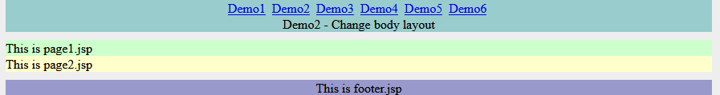
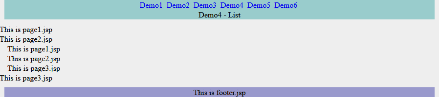

### jWebBox
**License:** [Apache 2.0](http://www.apache.org/licenses/LICENSE-2.0)  
 
JWebBox is a small layout tool used in Java server pages(JSP) projects, playing the same role like Tiles and SiteMesh, but it's pure Object-Oriented designed, no XML files, no Tags, it's powerful but simple(only 2 Java files) and easy to use, it can be used to build whole web site or only some page components.

#### Shortage of some other JSP layout tools：
* Apache Tiles: too complicated, too many dependencies, XML configuration is not easy use.
* Sitemesh: not flexible, poor performance.
* JSP Layout or Stripes: not powerful, has problem in extending and parameter transfer.

#### Features of JWebBox:
1. Easy, only 2 Java file, 400 lines source code, easy to study.
2. Use pure Java as configuration, support dynamic configuration, configuration can be built at run time.
3. No invation, can be used together with other tool like Tiles or SiteMesh, and mix use JSP with Freemaker.
4. Support 3 data prepare methods: static method, bean method, URL.

#### How to use：
Add below lines in project's pom.xml：
```
  <dependency>  
    <groupId>com.github.drinkjava2</groupId>
    <artifactId>jwebbox</artifactId>  
    <version>2.1</version>  
  </dependency> 
  
  <dependency>
    <groupId>javax.servlet</groupId>
    <artifactId>javax.servlet-api</artifactId>
    <version>3.0.1</version> <!-- or other version -->
    <scope>provided</scope>
  </dependency>
  
   <dependency>
    <groupId>javax.servlet.jsp</groupId>
    <artifactId>javax.servlet.jsp-api</artifactId>
    <version>2.3.1</version> <!-- or other version -->
    <scope>provided</scope>
   </dependency>   
```
jWebBox run on Java6+, depends on javax.servlet-api and javax.jsp-api which are provided by servlet container.

#### Introduction
There is a demo project shows how to use jWebBox, the demo project located in jwebbox-demo folder, and there is a "jwebbox-demo.war" file can be run on Tomcat or WebLogic.

#### Demo 1 - A basic example 
``` 
  public static class demo1 extends WebBox {
    {   this.setPage("/WEB-INF/pages/homepage.jsp");
      this.setAttribute("menu",
          new WebBox("/WEB-INF/pages/menu.jsp").setAttribute("msg", "Demo1 - A basic layout"));
      this.setAttribute("body", new LeftRightLayout());
      this.setAttribute("footer", "/WEB-INF/pages/footer.jsp");
    }
  }

  public static class LeftRightLayout extends WebBox {
    {   this.setPage("/WEB-INF/pages/left_right_layout.jsp");
      ArrayList<Object> boxlist = new ArrayList<Object>();
      boxlist.add("/WEB-INF/pages/page1.jsp");
      boxlist.add("/WEB-INF/pages/page2.jsp");
      this.setAttribute("boxlist", boxlist);
    }
  }
```
homepage.jsp is a template JSP file:
```
<%@ taglib prefix="box" uri="https://github.com/drinkjava2/jwebbox/tld"%> 
<html>
  <body>
    <div id="temp_content">
      <div id="temp_menu"> 
            <box:show attribute="menu" /> 
      </div>
             <box:show attribute="body" /> 
       <div id="temp_footer"> 
           <box:show attribute="footer" />  
      </div>  
    </div>
  </body>
</html>
```
left_right_layout.jsp：
```
<%@ taglib prefix="box" uri="http://github.com/drinkjava2/jwebbox"%> 
<div id="temp_left" style="margin: 10px; width: 430px; float: left; background-color:#CCFFCC;"> 
    <box:show target="${jwebbox.attributeMap.boxlist[0]}" />
</div>
<div id="temp_right"  style="margin: 10px; float: right; width: 430px;background-color:#FFFFCC;">
     <box:show target="${jwebbox.attributeMap.boxlist[1]}" />
</div>
```
Explain:  
* Method "setPage" set a target page, 1 WebBox can only set 1 target page, WebBox's constructor allow a page as constructor parameter.
* Method "setAttribute" set a value in WebBox, to get the value, use getAttribute method.
* In JSP page, use <box:show attribute="body" /> to show JSP page or WebBox, below 5 usuages have same effect: 
```
   <box:show attribute="menu" />                                                         
   <box:show target="${jwebbox.attributeMap.menu}" />   
   <% WebBox.showAttribute(pageContext,"menu");%>   
   <% WebBox.showTarget(pageContext, WebBox.getAttribute(pageContext,"menu"));%>           
   <% ((WebBox)WebBox.getAttribute(pageContext,"menu")).show(pageContext);%>  //
```
Screenshots of demo 1:


#### Demo 2 - Extending of layout
```
  public static class demo2 extends demo1 {
    {  ((WebBox) this.getAttribute("menu")).setAttribute("msg", "Demo2 - Change body layout");
      this.setAttribute("body", new TopDownLayout());
    }
  }

  public static class TopDownLayout extends LeftRightLayout {
    {  this.setPage("/WEB-INF/pages/top_down_layout.jsp");
    }
  }
```
demo2 extends demo1, change "body" to top-down layout.  

Screenshots of demo 2： 



#### Demo 3 - Data prepare
```
  public static class demo3 extends demo1 {
    {  setPrepareStaticMethod(DemoBoxConfig.class.getName() + ".changeMenu");
      setAttribute("body", new WebBox().setText("<div style=\"width:900px\"> This is body text </div>")
          .setPrepareURL("/WEB-INF/pages/prepare.jsp").setPrepareBean(new Printer()));
      setAttribute("footer", new WebBox("/WEB-INF/pages/footer.jsp").setPrepareBean(new Printer())
          .setPrepareBeanMethod("print"));
    }
  }

  public static void changeMenu(PageContext pageContext, WebBox callerBox) throws IOException {
    ((WebBox) callerBox.getAttribute("menu")).setAttribute("msg",
        "Demo3 - Prepare methods <br/>This is modified by \"changeMenu\" static method");
  }

  public static class Printer {
    public void prepare(PageContext pageContext, WebBox callerBox) throws IOException {
      pageContext.getOut().write("This is printed by Printer's default \"prepare\" method <br/>");
    }

    public void print(PageContext pageContext, WebBox callerBox) throws IOException {
      pageContext.getOut().write("This is printed by Printer's \"print\" method <br/>");
      pageContext.getOut().write((String) pageContext.getRequest().getAttribute("urlPrepare"));
    }
  }
```
jWebBox supports 3 data prepare methods:
* setPrepareStaticMethod method assign a static method to prepare data.
* setPrepareBean method assign a Bean's to prepare data, setPrepareBeanMethod method set the method name, if not set method name, will use "prepare" as default name.
* setPrepareURL method will call a URL to prepare data, this is a server side call can access files under /WEB-INF folder.
And there is a setText method to set extra html text output.

The order of methods be called and output see below:
prepareStaticMethod -> prepareBeanMethod -> setPrepareURL -> text output -> page  

Screenshots of demo 3： 


#### Demo 4 - List
```
  public static class demo4 extends demo1 {
    {
      ((WebBox) this.getAttribute("menu")).setAttribute("msg", "Demo4 - List");
      ArrayList<Object> child = new ArrayList<Object>();
      for (int i = 1; i <= 3; i++)
        child.add(new WebBox("/WEB-INF/pages/page" + i + ".jsp").setText("&nbsp;&nbsp;&nbsp;&nbsp;"));
      ArrayList<Object> mainList = new ArrayList<Object>();
      for (int i = 1; i <= 3; i++) {
        mainList.add("/WEB-INF/pages/page" + i + ".jsp");
        if (i == 2)
          mainList.add(child);
      }
      this.setAttribute("body", mainList);
    }
  }
```
If attribute is a list, when use <box:show attribute="xxx" /> in JSP page, will assume all items in list are page or WebBox instance and show them.

Screenshots of demo 4：  


#### Demo 5 - FreeMaker template support
```
  public static class demo5 extends WebBox {
    {  this.setPage("/WEB-INF/pages/homepage.ftl");
      this.setAttribute("menu",
          new WebBox("/WEB-INF/pages/menu.jsp").setAttribute("msg", "Demo5 - Freemaker demo"));
      this.setAttribute("body", new FreemakerLeftRightLayout());
      this.setAttribute("footer", new WebBox("/WEB-INF/pages/footer.jsp"));
    }
  }
```
FreeMaker has different grammar compare to JSP, use <#assign box=JspTaglibs["http://github.com/drinkjava2/jwebbox"] /> and <@box.show attribute="menu" /> to use TagLib.
And dd below lines in web.xml：
```
  <servlet>
    <servlet-name>freemarker</servlet-name>
    <servlet-class>freemarker.ext.servlet.FreemarkerServlet</servlet-class>
    <init-param>
      <param-name>TemplatePath</param-name>
      <param-value>/</param-value>
    </init-param>
  </servlet>

  <servlet-mapping>
    <servlet-name>freemarker</servlet-name>
    <url-pattern>*.ftl</url-pattern>
  </servlet-mapping>
```
And in pom.xml:
```  
 <dependency>
     <groupId>org.freemarker</groupId>
     <artifactId>freemarker</artifactId>
     <version>2.3.23</version> <!--or newer version-->
  </dependency>   
```
Screenshots of demo 5： 


#### Demo6 - Table, pagination, and receive data form post.
This example shows uses jWebBox to create tables and pagination bars, here only shows source code of layouts, for detail please see source code of demo project.
```
  public static class demo6 extends demo1 {
    {
      setAttribute("menu",
          ((WebBox) this.getAttribute("menu")).setAttribute("msg", "Demo6 - Table & Pagination"));
      List<WebBox> bodyList = new ArrayList<WebBox>();
      bodyList.add(new TableBox());
      bodyList.add(new TablePaginBarBox());
      bodyList.add(new WebBox().setText(
          "<br/>-----------------------------------------------------------------------------------"));
      bodyList.add(new CommentBox());
      bodyList.add(new CommentPaginBarBox());
      bodyList.add(new WebBox("/WEB-INF/pages/commentform.jsp"));
      this.setPrepareStaticMethod(DemoBoxConfig.class.getName() + ".receiveCommentPost");
      this.setAttribute("body", bodyList);
    }

    class TableBox extends WebBox {
      {
        this.setPrepareBean(new PrepareForDemo6()).setPrepareBeanMethod("prepareTable");
        setPage("/WEB-INF/pages/page_table.jsp");
        setAttribute("pageId", "table");
        setAttribute("targetList", tableDummyData);
        setAttribute("row", 3).setAttribute("col", 4);
        setAttribute("render", new WebBox("/WEB-INF/pages/render_table.jsp"));
      }
    }

    class TablePaginBarBox extends TableBox {
      {
        this.setPrepareBean(new PrepareForDemo6()).setPrepareBeanMethod("preparePaginBar");
        setPage("/WEB-INF/pages/pagin_bar.jsp");
      }
    }

    class CommentBox extends TableBox {
      {
        setAttribute("pageId", "comment");
        setAttribute("targetList", commentDummyData);
        setAttribute("row", 3).setAttribute("col", 1);
        setAttribute("render", new WebBox("/WEB-INF/pages/render_comment.jsp"));
      }
    }

    class CommentPaginBarBox extends CommentBox {
      {
        this.setPrepareBean(new PrepareForDemo6()).setPrepareBeanMethod("preparePaginBar");
        setPage("/WEB-INF/pages/pagin_bar.jsp");
      }
    }
  }  
```

Screenshots of demo 6：  


Above are all documents of jWebBox project, if not clear please see source code of demo project.
