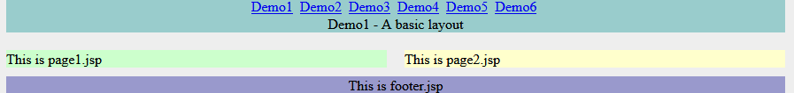

(English instruction please see [README-English.md](README-English.md))  
### jWebBox
**License:** [Apache 2.0](http://www.apache.org/licenses/LICENSE-2.0)  
 
这是一个服务端(支持JSP和FreeMaker)页面布局工具，特点是简单，无XML，仅有400行源码，实现了与Apache Tiles类似的页面布局功能。

#### 目前一些服务端JSP页面布局工具的缺点：
* Apache Tiles: 功能强大但过于臃肿，源码复杂，第三方库引用多，XML配置不方便，动态配置功能差。
* Sitemesh: 采用装饰器模式，功能不如Apache Tiles灵活。  
* JSP Layout或Stripes等JSP布局工具：功能不够强，在布局的继承或参数传递上有问题。

#### JWebBox特点：
1. 简单, 整个项目仅由2个文件、400行源码组成，无第三方依赖，易于学习和维护。
2. 与jBeanBox和jSqlBox项目类似，用纯JAVA类代替XML配置（实际上前两个项目是受此项目启发)，支持动态配置，配置可以在运行期动态生成和修改。
3. 无侵入性，可以和其它页面布局工具如Tiles或Sitemesh混用，支持JSP和FreeMaker混用。可用于整个网站的服务端布局，也可用于编写页面局部零件。
4. 支持静态方法、实例方法、URL引用三种数据准备方式。

#### jWebBox2.1版本更新：
更正了在WebLogic上运行的Bug;添加FreeMaker模板支持;增加一个JSP标签;添加了表格、分页、表单处理的演示； 

#### 使用方法：
* 方式1：将WebBox.java源文件拷到项目的源码中，将TagLib标签描述文件jwebbox.tld拷到项目的/WEB-INF/目录下。
* 方式2：在项目的pom.xml中添加如下内容即可：
```
  <dependency>  
    <groupId>com.github.drinkjava2</groupId>
    <artifactId>jwebbox</artifactId>  
    <version>2.1</version>  
  </dependency>
```
jWebBox运行于Java6或以上，除了javax.servlet-api和javax.servlet.jsp-api这两个运行期库外(由Servlet容器提供)，没有其它第三方库依赖。  

#### 详细介绍
以下通过对示例的解释来详细说明jWebBox的使用，示例项目源码位于项目的jwebbox-demo目录下，在项目的根目录，也有一个打包好的(含源码)demo.war文件，可直接扔到Tomcat或webLogic里运行。

#### 示例1 - 基本布局  
示例1, 一个带菜单和底脚的左右布局：

服务端代码如下
``` 
  public static class demo1 extends WebBox {
    {   this.setPage("/WEB-INF/pages/homepage.jsp");
      this.setAttribute("menu",
          new WebBox("/WEB-INF/pages/menu.jsp").setAttribute("msg", "Demo1 - A basic layout"));
      this.setAttribute("body", new LeftRightLayout());
      this.setAttribute("footer", "/WEB-INF/pages/footer.jsp");
    }
  }

  public static class LeftRightLayout extends WebBox {
    {   this.setPage("/WEB-INF/pages/left_right_layout.jsp");
      ArrayList<Object> boxlist = new ArrayList<Object>();
      boxlist.add("/WEB-INF/pages/page1.jsp");
      boxlist.add("/WEB-INF/pages/page2.jsp");
      this.setAttribute("boxlist", boxlist);
    }
  }
```
其中homepage.jsp是主模板文件，主要内容如下：
```
<#assign box=JspTaglibs["http://github.com/drinkjava2/jwebbox"] />
<html>
	<body>
		<div id="temp_content">
			<div id="temp_menu">
 				  <@box.show attribute="menu" />
			</div> 
			 	  <@box.show attribute="body" />
			 <div id="temp_footer">
				  <@box.show attribute="footer" />
			</div>	
		</div>
	</body>
</html>
```
left_right_layout.jsp是一个布局模板，内容如下(其它的JSP文件类似，此处略，详见示例)：
```
<%@ taglib prefix="box" uri="http://github.com/drinkjava2/jwebbox"%> 
<div id="temp_left" style="margin: 10px; width: 430px; float: left; background-color:#CCFFCC;"> 
    <box:show target="${jwebbox.attributeMap.boxlist[0]}" />
</div>
<div id="temp_right"  style="margin: 10px; float: right; width: 430px;background-color:#FFFFCC;">
     <box:show target="${jwebbox.attributeMap.boxlist[1]}" />
</div>
```
解释:  
* setPage方法用于设定当前WebBox实例的目标页面(可选)，WebBox构造器允许带一个页面参数。 
* setAttribute方法在WebBox的一个内部HashMap中暂存一个键值，值可以为任意Java对象类型，相应地取值用getAttribute方法，在JSP中可以用EL表达式${jwebbox.attributeMap.keyname}获取。
* 在JSP页面中调用<box:show attribute="body" />标签来显示对应键值的页面，值只能是String、WebBox实例或它们的List。
* show标签的另一个用法是<box:show target="xxx"/> target只能是String、WebBox或List。如下5种写法在JSP中是等同的:
```
   <box:show attribute="menu" />                                                         
   <box:show target="${jwebbox.attributeMap.menu}" />   
   <% WebBox.showAttribute(pageContext,"menu");%>   
   <% WebBox.showTarget(pageContext, WebBox.getAttribute(pageContext,"menu"));%>           
   <% ((WebBox)WebBox.getAttribute(pageContext,"menu")).show(pageContext);%>  //仅当menu属性为WebBox对象时  
```
后三种写法不推荐，但有助于理解WebBox的运作机制。每个被WebBox调用的页面，都在request中存在一个WebBox实例，可以用request.getAttribute("jwebbox")或EL表达式${jwebbox}获取。 
* show标签使用时必须在JSP页面加入TagLib库的引用：<%@ taglib prefix="box" uri="http://github.com/drinkjava2/jwebbox"%> 
* 每个WebBox实例，可以设定一个可选的name属性，每个页面用只能获取属于自已的一个WebBox实例，但是可以用getFatherWebBox方法获取当前WebBox实例的调用者所在页面的WebBox实例(有点绕口)。
* 在JSP和Servlet中,jWebBox支持在页面中动态生成WebBox实例并调用show方法显示，例如:<% new WebBox("/somepage.jsp").setPrepareStaticMethod("xxx").show(pageContext); %>
* 本示例项目中运用了一个小技巧，利用一个Servlet将所有".htm"后缀的访问转化对WebBox的访问，在web.xml中配置如下
```
  <servlet>
    <servlet-name>htm2box</servlet-name>
    <jsp-file>/htm2box.jsp</jsp-file>
  </servlet>

  <servlet-mapping>
    <servlet-name>htm2box</servlet-name>
    <url-pattern>*.htm</url-pattern>
  </servlet-mapping>
```
htm2box.jsp是一个简洁的用于转发的Servlet，作用类似于Spring MVC中的DispatcherServlet, 所有.htm的访问经由这个Servlet处理成对WebBox实例的创建和显示。
```
<%@page import="com.github.drinkjava2.jwebbox.WebBox"%><%
 String uri = substringBetween(request.getRequestURI(), "/", ".htm");
 WebBox box = (WebBox)Class.forName("com.github.drinkjava2.jwebboxdemo.DemoBoxConfig$" + uri).newInstance();
 box.show(pageContext);
%>
```

#### 示例2 - 布局的继承
服务端代码：
```
  public static class demo2 extends demo1 {
    {  ((WebBox) this.getAttribute("menu")).setAttribute("msg", "Demo2 - Change body layout");
      this.setAttribute("body", new TopDownLayout());
    }
  }

  public static class TopDownLayout extends LeftRightLayout {
    {  this.setPage("/WEB-INF/pages/top_down_layout.jsp");
    }
  }
```
demo2继承于demo1类，将"body"属性改成了一个上下布局top_down_layout.jsp模板(源码见示例)。  

示例2的输出：   


#### 示例3 - 数据准备
服务端代码：
```
  public static class demo3 extends demo1 {
    {  setPrepareStaticMethod(DemoBoxConfig.class.getName() + ".changeMenu");
      setAttribute("body", new WebBox().setText("<div style=\"width:900px\"> This is body text </div>")
          .setPrepareURL("/WEB-INF/pages/prepare.jsp").setPrepareBean(new Printer()));
      setAttribute("footer", new WebBox("/WEB-INF/pages/footer.jsp").setPrepareBean(new Printer())
          .setPrepareBeanMethod("print"));
    }
  }

  public static void changeMenu(PageContext pageContext, WebBox callerBox) throws IOException {
    ((WebBox) callerBox.getAttribute("menu")).setAttribute("msg",
        "Demo3 - Prepare methods <br/>This is modified by \"changeMenu\" static method");
  }

  public static class Printer {
    public void prepare(PageContext pageContext, WebBox callerBox) throws IOException {
      pageContext.getOut().write("This is printed by Printer's default \"prepare\" method <br/>");
    }

    public void print(PageContext pageContext, WebBox callerBox) throws IOException {
      pageContext.getOut().write("This is printed by Printer's \"print\" method <br/>");
      pageContext.getOut().write((String) pageContext.getRequest().getAttribute("urlPrepare"));
    }
  }
```
相比与普通的Include指令，Apache Tiles和jWebBox这类布局工具的优势之一在于可以在各个子页面加载之前进行数据准备工作。jWebBox有三种数据准备方式:  
* setPrepareStaticMethod方法指定一个静态方法用于数据准备。
* setPrepareBean方法指定一个对象实例用于数据准备，用setPrepareBeanMethod来指定对象的方法名，如果不指定方法名，将缺省使用"prepare"作为方法名。
* setPrepareURL方法将调用一个URL来作为数据谁备，这是一个服务端的URL引用，可以访问/WEB-INF目录下的内容。
* setText方法可以额外设置一小段文本，将直接作为HTML代码片段插入到子页面前面。

各个准备方法及页面输出的顺序如下：  
prepareStaticMethod -> prepareBeanMethod -> PrepareURL -> text output -> page

示例3输出：   


#### 示例4 - 列表
服务端代码：
```
  public static class demo4 extends demo1 {
    {
      ((WebBox) this.getAttribute("menu")).setAttribute("msg", "Demo4 - List");
      ArrayList<Object> child = new ArrayList<Object>();
      for (int i = 1; i <= 3; i++)
        child.add(new WebBox("/WEB-INF/pages/page" + i + ".jsp").setText("&nbsp;&nbsp;&nbsp;&nbsp;"));
      ArrayList<Object> mainList = new ArrayList<Object>();
      for (int i = 1; i <= 3; i++) {
        mainList.add("/WEB-INF/pages/page" + i + ".jsp");
        if (i == 2)
          mainList.add(child);
      }
      this.setAttribute("body", mainList);
    }
  }
```
如果属性是一个列表，当JSP页面中调用<box:show attribute="xxx" />方法时，如果值是一个List,将假定List中属性为页面或WebBox实例并依次显示。  
示例4输出：   


#### 示例5 - FreeMaker模板支持
从2.1版起,jWebBox开始支持FreeMaker,且可以与JSP混用，例如如下配置：
```
  public static class demo5 extends WebBox {
    {  this.setPage("/WEB-INF/pages/homepage.ftl");
      this.setAttribute("menu",
          new WebBox("/WEB-INF/pages/menu.jsp").setAttribute("msg", "Demo5 - Freemaker demo"));
      this.setAttribute("body", new FreemakerLeftRightLayout());
      this.setAttribute("footer", new WebBox("/WEB-INF/pages/footer.jsp"));
    }
  }
```
FreeMaker不支持直接在页面嵌入Java代码，语法也与JSP不同，引入标签要写成<#assign box=JspTaglibs["http://github.com/drinkjava2/jwebbox"] />, show标签要写成<@box.show attribute="menu" />  
使用FreeMaker,需要在web.xml中添加如下配置：
```
  <servlet>
    <servlet-name>freemarker</servlet-name>
    <servlet-class>freemarker.ext.servlet.FreemarkerServlet</servlet-class>
    <init-param>
      <param-name>TemplatePath</param-name>
      <param-value>/</param-value>
    </init-param>
  </servlet>

  <servlet-mapping>
    <servlet-name>freemarker</servlet-name>
    <url-pattern>*.ftl</url-pattern>
  </servlet-mapping>
```
并在pom.xml中添加对FreeMaker库的依赖：
```  
 <dependency>
     <groupId>org.freemarker</groupId>
     <artifactId>freemarker</artifactId>
     <version>2.3.23</version> <!--或更新版-->
  </dependency>
   
```
示例5输出：   


#### 示例6 - 表格和分页演示
这个例子展示了利用WebBox配置的继承功能来创建表格和分页条组件，输出两个表格和分页条，并处理表单提交数据。因篇幅较长，此处只摘录布局部分代码：
```
  public static class demo6 extends demo1 {
    {
      setAttribute("menu",
          ((WebBox) this.getAttribute("menu")).setAttribute("msg", "Demo6 - Table & Pagination"));
      List<WebBox> bodyList = new ArrayList<WebBox>();
      bodyList.add(new TableBox());
      bodyList.add(new TablePaginBarBox());
      bodyList.add(new WebBox().setText(
          "<br/>-----------------------------------------------------------------------------------"));
      bodyList.add(new CommentBox());
      bodyList.add(new CommentPaginBarBox());
      bodyList.add(new WebBox("/WEB-INF/pages/commentform.jsp"));
      this.setPrepareStaticMethod(DemoBoxConfig.class.getName() + ".receiveCommentPost");
      this.setAttribute("body", bodyList);
    }

    class TableBox extends WebBox {
      {
        this.setPrepareBean(new PrepareForDemo6()).setPrepareBeanMethod("prepareTable");
        setPage("/WEB-INF/pages/page_table.jsp");
        setAttribute("pageId", "table");
        setAttribute("targetList", tableDummyData);
        setAttribute("row", 3).setAttribute("col", 4);
        setAttribute("render", new WebBox("/WEB-INF/pages/render_table.jsp"));
      }
    }

    class TablePaginBarBox extends TableBox {
      {
        this.setPrepareBean(new PrepareForDemo6()).setPrepareBeanMethod("preparePaginBar");
        setPage("/WEB-INF/pages/pagin_bar.jsp");
      }
    }

    class CommentBox extends TableBox {
      {
        setAttribute("pageId", "comment");
        setAttribute("targetList", commentDummyData);
        setAttribute("row", 3).setAttribute("col", 1);
        setAttribute("render", new WebBox("/WEB-INF/pages/render_comment.jsp"));
      }
    }

    class CommentPaginBarBox extends CommentBox {
      {
        this.setPrepareBean(new PrepareForDemo6()).setPrepareBeanMethod("preparePaginBar");
        setPage("/WEB-INF/pages/pagin_bar.jsp");
      }
    }
  }
```

示例6截图：   


以上即为jWebBox的全部说明文档，如有不清楚处，可以查看示例项目源码。